# Лабораторная работа №3
## «Исследование архитектурного решения»

# Часть 1: Проектирование архитектуры системы

**Проект:** Сервис аренды автомобилей  
**Стек технологий:** React, Node.js (Express), PostgreSQL

## 1. Тип приложения

Система проектируется как **Rich Internet Application (RIA)** на базе архитектуры **Single Page Application (SPA)**.

* **Frontend:** Клиентская часть реализуется на React, что обеспечивает высокую интерактивность и отсутствие перезагрузок страниц при навигации по каталогу.
* **Backend:** Серверная часть представляет собой **Stateless RESTful API**, который обрабатывает бизнес-логику и взаимодействует с базой данных, обмениваясь с клиентом данными в формате JSON.

## 2. Стратегия развёртывания

**Тип развёртывания:** выбрано **распределённое развёртывание** (distributed deployment): приложение состоит из нескольких независимо разворачиваемых компонентов (фронтенд, бэкенд, БД), каждый может масштабироваться и обновляться отдельно. Альтернативы — *монолитное* (всё в одном процессе/образе), *гибридное* (часть в облаке, часть on-premise) и *serverless* (функции по запросу). Для нашего сервиса распределённый вариант даёт гибкость по масштабированию API и статики и изоляцию сбоев.

Для обеспечения воспроизводимости среды и упрощения масштабирования реализация идёт через **контейнеризацию**:

* **Docker:** Приложение разделяется на три контейнера: `frontend-container` (Nginx + статика), `backend-container` (Node.js runtime) и `db-container` (PostgreSQL).
* **Окружение:** На этапе разработки используется Docker Compose. Для продакшн-развертывания подразумевается использование VPS или облачных PaaS-решений.

## 3. Обоснование выбора технологий

* **JavaScript End-to-End:** Использование одного языка (JavaScript/TypeScript) для фронтенда и бэкенда снижает когнитивную нагрузку на команду и упрощает передачу структур данных.
* **React:** Выбран за компонентный подход, который идеально подходит для создания переиспользуемых элементов интерфейса (карточки авто, формы фильтрации) и эффективного обновления DOM при работе с большими списками.
* **Node.js & Express:** Легковесность и высокая производительность при обработке асинхронных запросов (I/O), что критично для API сервиса.
* **PostgreSQL:** Реляционная СУБД выбрана для обеспечения строгой целостности данных (ACID-транзакции), что необходимо при обработке бронирований и исключении двойной аренды одного авто.

## 4. Показатели качества

В соответствии с атрибутами качества, система должна соответствовать следующим критериям:

* **Производительность:** Время отклика API на запросы чтения каталога не должно превышать 200мс.
* **Безопасность:** Использование протокола HTTPS, защита от SQL-инъекций через ORM и авторизация на базе JWT-токенов.
* **Сопровождаемость:** Четкое разделение ответственности между слоями (Separation of Concerns) для независимого тестирования и обновления компонентов.
* **Доступность:** Архитектура должна позволять перезапуск отдельных сервисов без остановки всей системы.

## 5. Сквозная функциональность

Реализация механизмов, затрагивающих все слои приложения:

* **Аутентификация и авторизация:** Проверка прав доступа через Middleware на уровне сервера перед выполнением бизнес-логики.
* **Обработка исключений:** Единый механизм перехвата ошибок на бэкенде и стандартизированные ответы (Error Codes) для фронтенда.
* **Логирование:** Сбор логов запросов и ошибок (Winston/Morgan) для мониторинга состояния системы.
* **Валидация:** Проверка входных данных на соответствие схемам (например, Zod или Joi) до момента попадания данных в бизнес-слой.

## 6. Структурная схема приложения (Архитектура To-Be)



### Описание слоев функциональности:

1. **Слой представления:** React-компоненты и управление состоянием на стороне клиента.
2. **Слой сервисов:** REST API эндпоинты, принимающие запросы и управляющие сквозной функциональностью.
3. **Бизнес-слой:** Логика обработки заказов, расчет стоимости и правила валидации бизнес-объектов.
4. **Слой доступа к данным:** Инкапсуляция логики взаимодействия с PostgreSQL через ORM или Query Builder.

---

# Часть 2: Анализ архитектуры (As Is)

## Текущая реализация системы

На основе анализа реального кода проекта выявлена следующая архитектура:

### Структура проекта

```
sdlc/
├── backend/
│   ├── src/
│   │   ├── index.js          # Точка входа, Express app
│   │   ├── routes/
│   │   │   └── cars.js        # Роуты для работы с автомобилями
│   │   └── db/
│   │       ├── db.js          # Подключение к SQLite
│   │       ├── init.js        # Инициализация схемы БД
│   │       └── seed.js        # Заполнение тестовыми данными
│   └── package.json
└── frontend/
    ├── src/
    │   ├── App.jsx            # Роутинг (React Router)
    │   ├── pages/
    │   │   ├── Catalog.jsx    # Страница каталога
    │   │   └── CarDetail.jsx  # Страница деталей авто
    │   ├── components/
    │   │   ├── CarCard.jsx
    │   │   ├── CatalogFilters.jsx
    │   │   └── Layout.jsx
    │   └── api/
    │       └── cars.js         # API клиент (fetch)
    └── package.json
```

### Диаграмма архитектуры As Is



### Диаграмма классов (упрощенная)


### Ключевые особенности текущей реализации:

1. **Backend:**
   - Используется **SQLite** вместо PostgreSQL (для упрощения разработки)
   - **Нет ORM** — прямые SQL-запросы через `better-sqlite3`
   - **Нет сервисного слоя** — бизнес-логика находится в роутах
   - **Нет middleware для аутентификации** — все эндпоинты публичные
   - **Базовый error handler** — только общий перехват ошибок
   - **Нет валидации входных данных** — проверка только на уровне SQL

2. **Frontend:**
   - **Нет state management** (Redux/Context) — используется только локальный `useState`
   - **Нативный fetch API** вместо Axios
   - Компонентная архитектура реализована корректно
   - Роутинг через React Router

3. **Сквозная функциональность:**
   - **Аутентификация:** отсутствует
   - **Логирование:** только `console.error` на бэкенде
   - **Валидация:** отсутствует
   - **Обработка ошибок:** базовая реализация

---

# Часть 3: Сравнение и рефакторинг

## 3.1 Сравнение архитектур «As Is» и «To Be»

### Таблица сравнения

| Аспект | To Be (Целевая) | As Is (Текущая) | Отличие |
|--------|----------------|-----------------|---------|
| **База данных** | PostgreSQL | SQLite | Упрощенная БД для разработки |
| **ORM** | Sequelize/Prisma | Отсутствует | Прямые SQL-запросы |
| **Архитектурные слои** | 4 слоя (Presentation, Service, Business, DAL) | 2 слоя (Routes, DB) | Отсутствует разделение на Business и Service слои |
| **State Management** | Redux/Context API | useState (локальное) | Нет централизованного управления состоянием |
| **API Client** | Axios | fetch (нативный) | Использование нативного API |
| **Аутентификация** | JWT Middleware | Отсутствует | Публичные эндпоинты |
| **Валидация** | Zod/Joi | Отсутствует | Нет проверки входных данных |
| **Логирование** | Winston/Morgan | console.error | Примитивное логирование |
| **Обработка ошибок** | Единый механизм с кодами | Базовый try-catch | Нет стандартизации |
| **Repository Pattern** | Реализован | Отсутствует | Прямой доступ к БД из роутов |

### Визуальное сравнение слоев



## 3.2 Анализ причин отличий

### 1. Упрощение для первой итерации

**Причина:** Проект находится на ранней стадии разработки. Команда сознательно упростила архитектуру для быстрого прототипирования.

**Обоснование:**
- SQLite вместо PostgreSQL — не требует установки внешней СУБД, упрощает локальную разработку
- Отсутствие ORM — снижает сложность на начальном этапе, прямые SQL-запросы проще для понимания
- Нет аутентификации — функционал аренды еще не реализован, авторизация не требуется

### 2. Минималистичный подход

**Причина:** Следование принципу YAGNI (You Aren't Gonna Need It) — не добавлять функциональность, которая не нужна сейчас.

**Обоснование:**
- Нет Redux/Context — состояние простое, локальный useState достаточен
- Нативный fetch вместо Axios — меньше зависимостей, проще bundle
- Базовый error handler — достаточно для текущих потребностей

### 3. Ограничения времени и ресурсов

**Причина:** Групповой проект с ограниченным временем на первый этап разработки.

**Обоснование:**
- Отсутствие валидации — можно добавить позже, когда появятся формы создания/редактирования
- Примитивное логирование — достаточно для отладки на этапе разработки

## 3.3 Пути улучшения архитектуры

### Приоритет 1: Критичные улучшения (для следующего этапа разработки)

#### 1.1 Внедрение валидации входных данных

**Проблема:** Отсутствие валидации может привести к SQL-инъекциям и некорректным данным.

**Решение:**
```javascript
// Добавить middleware валидации
import { z } from 'zod';

const carQuerySchema = z.object({
  model: z.string().optional(),
  maxPrice: z.number().positive().optional()
});

// В роуте
carsRouter.get('/', validateQuery(carQuerySchema), async (req, res) => {
  // ...
});
```

**Принцип:** **Defense in Depth** — многоуровневая защита данных.

#### 1.2 Разделение на слои (Service + Business)

**Проблема:** Бизнес-логика смешана с логикой роутинга, сложно тестировать.

**Решение:**
```javascript
// services/carService.js
export class CarService {
  async getCars(filters) {
    // Бизнес-логика фильтрации
    return await carRepository.find(filters);
  }
}

// routes/cars.js
carsRouter.get('/', async (req, res) => {
  const cars = await carService.getCars(req.query);
  res.json(cars);
});
```

**Принцип:** **Separation of Concerns** — разделение ответственности.

#### 1.3 Внедрение Repository Pattern

**Проблема:** Прямой доступ к БД из роутов усложняет замену БД и тестирование.

**Решение:**
```javascript
// repositories/carRepository.js
export class CarRepository {
  async findAll(filters) {
    // Инкапсуляция SQL-логики
  }
  
  async findById(id) {
    // ...
  }
}
```

**Принцип:** **Dependency Inversion** — зависимость от абстракций, а не от конкретной реализации.

### Приоритет 2: Важные улучшения (для продакшна)

#### 2.1 Миграция на PostgreSQL

**Причина:** SQLite не поддерживает конкурентные записи и ограничен для продакшна.

**План:**
1. Добавить поддержку обеих БД через абстракцию
2. Использовать переменные окружения для выбора БД
3. Постепенно мигрировать на PostgreSQL

**Принцип:** **Portability** — возможность работы с разными окружениями.

#### 2.2 Внедрение ORM (Prisma)

**Преимущества:**
- Типобезопасность
- Миграции схемы БД
- Защита от SQL-инъекций

**План:**
```javascript
// prisma/schema.prisma
model Car {
  id              Int      @id @default(autoincrement())
  model           String
  year            Int
  price_per_day_byn Float
  // ...
}
```

**Принцип:** **DRY (Don't Repeat Yourself)** — избежание дублирования кода.

#### 2.3 Централизованное управление состоянием

**Когда нужно:** При добавлении функционала аренды (корзина, избранное, история).

**Решение:** Context API или Redux Toolkit для глобального состояния.

**Принцип:** **Single Source of Truth** — единый источник истины для состояния.

### Приоритет 3: Улучшения качества кода

#### 3.1 Структурированное логирование

**Решение:**
```javascript
import winston from 'winston';

const logger = winston.createLogger({
  level: 'info',
  format: winston.format.json(),
  transports: [
    new winston.transports.File({ filename: 'error.log', level: 'error' }),
    new winston.transports.File({ filename: 'combined.log' })
  ]
});
```

**Принцип:** **Observability** — возможность наблюдать за системой.

#### 3.2 Стандартизация обработки ошибок

**Решение:**
```javascript
// middleware/errorHandler.js
export class AppError extends Error {
  constructor(message, statusCode) {
    super(message);
    this.statusCode = statusCode;
  }
}

// В роуте
if (!car) throw new AppError('Car not found', 404);
```

**Принцип:** **Fail Fast** — быстрое обнаружение и обработка ошибок.

#### 3.3 Добавление тестов

**План:**
- Unit-тесты для бизнес-логики (Jest)
- Integration-тесты для API (Supertest)
- E2E-тесты для критичных сценариев (Playwright)

**Принцип:** **Testability** — тестируемость архитектуры.

### Архитектурные паттерны для применения

1. **Repository Pattern** — абстракция доступа к данным
2. **Service Layer Pattern** — инкапсуляция бизнес-логики
3. **Middleware Pattern** — перехват запросов для сквозной функциональности
4. **Factory Pattern** — создание объектов БД (для поддержки разных СУБД)
5. **Strategy Pattern** — выбор стратегии валидации/аутентификации

## 3.4 План рефакторинга

### Этап 1: Подготовка (1-я неделя)
- [ ] Добавить валидацию входных данных (Zod)
- [ ] Внедрить структурированное логирование (Winston)
- [ ] Стандартизировать обработку ошибок

### Этап 2: Рефакторинг слоев (1-я неделя)
- [ ] Выделить Repository слой
- [ ] Создать Service слой
- [ ] Разделить Business логику

### Этап 3: Миграция инфраструктуры (2-я неделя)
- [ ] Миграция на PostgreSQL
- [ ] Внедрение ORM (Prisma)
- [ ] Настройка Docker Compose

### Этап 4: Функциональные улучшения (по мере необходимости)
- [ ] Добавление аутентификации (JWT)
- [ ] Внедрение state management (Context API)
- [ ] Добавление тестового покрытия

## Выводы

Текущая архитектура системы (**As Is**) представляет собой упрощенную версию целевой архитектуры (**To Be**), что является **обоснованным решением** для первой итерации проекта. Упрощения были сделаны сознательно для:

1. **Быстрого прототипирования** — команда смогла быстро реализовать базовый функционал каталога
2. **Снижения сложности** — меньше зависимостей и абстракций упрощают понимание кода новыми участниками
3. **Гибкости** — упрощенная архитектура позволяет легко вносить изменения на ранних этапах

Однако для **дальнейшего развития** системы (добавление функционала аренды, аутентификации, админ-панели) необходимо постепенно внедрять элементы целевой архитектуры:

- **Разделение на слои** для улучшения тестируемости и поддерживаемости
- **Валидация и безопасность** для защиты от уязвимостей
- **Миграция на PostgreSQL** для поддержки продакшн-нагрузки
- **Сквозная функциональность** (логирование, обработка ошибок) для production-ready системы

Предложенный план рефакторинга позволяет **постепенно** улучшать архитектуру без необходимости полной переписи системы, следуя принципам **эволюционной архитектуры**.
